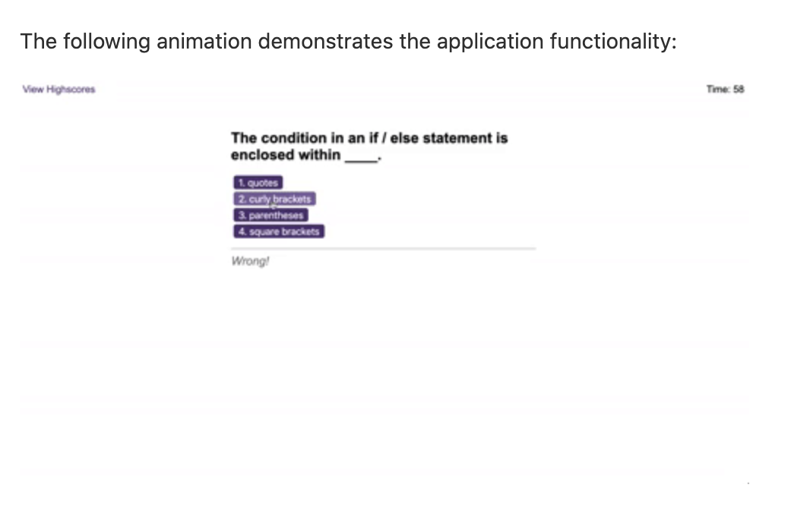

# Javascript: Quiz Games

## Background

This project is my attempt of creating a short quiz application which stores and fecthes the player's current and last score in local storage. The app runs in the browser and features dynamically updated HTML and CSS powered by JavaScript code. I also ensured the HTML elements followed a semantic structure and that the site was responsive through the use of CSS media queries. Comments were added throughout the Javascript file, highlighting the key coding blocks and evidence of console.log testing. 

[View my final project on GitHub pages](https://rubybassi.github.io/know-your-coding-facts-quiz/)

If you have feedback, please feel free to drop me a comment.

### User Story

AS A coding boot camp student
I WANT to take a timed quiz on JavaScript fundamentals that stores high scores
SO THAT I can gauge my progress compared to my peers

### Acceptance Criteria

> WHEN I click the start button
> THEN a timer starts and I am presented with a question

> WHEN I answer a question 
> THEN I am presented with another question

> WHEN I answer a question incorrectly 
> THEN time is subtracted from the clock

> WHEN all questions are answered or the timer reaches 0 
> THEN the game is over (call endgame function)

> WHEN the game is over
> THEN I can save my initials and score 

### Expected Layout Mockup

The following image was provided to demonstrate what the web application's layout should resemble, although there was room for customisation:

### My Development Enviromment:
* [Visual Studio Code](https://code.visualstudio.com/)
* Terminal
* [Git](https://git-scm.com/book/en/v2/Getting-Started-Installing-Git)